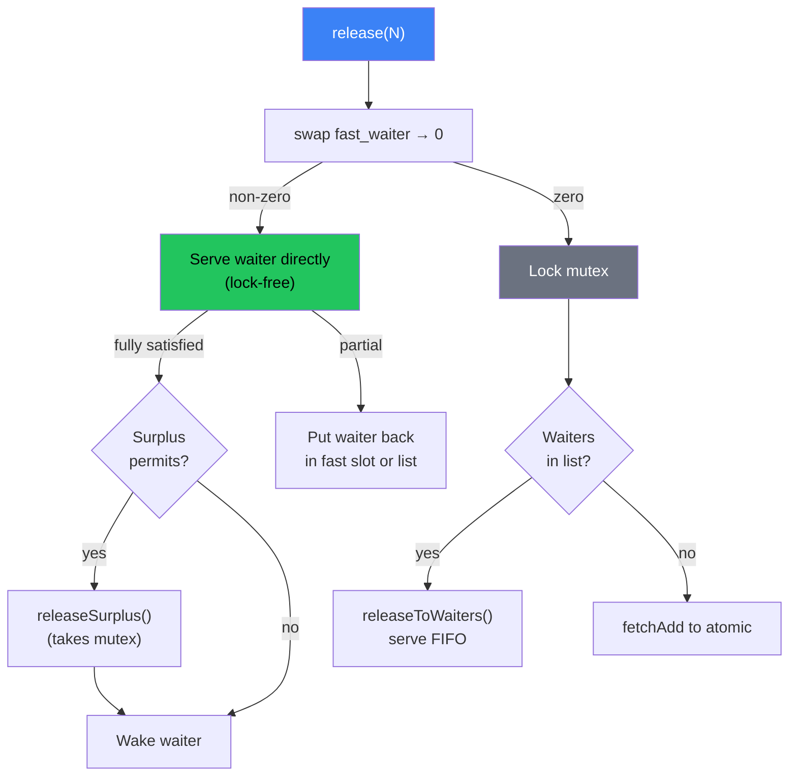

Volt's `Semaphore` is a counting semaphore that limits concurrent access to a resource. Tasks can acquire N permits (decrement) and release N permits (increment). When permits are unavailable, tasks yield to the scheduler rather than blocking the OS thread. The Mutex and RwLock primitives are built on top of the Semaphore.

The algorithm was carefully designed to prevent **permit starvation** -- a subtle bug where permits "slip through" between a failed CAS and waiter queue insertion, causing waiters to starve indefinitely.

## The Starvation Problem

Consider a naive semaphore implementation:

```
Thread A (acquirer):                Thread B (releaser):
1. CAS: try subtract N permits
   -> fails, not enough
2.                                   3. release(N): add N permits to atomic
4. lock mutex, add to waiter queue
5. unlock mutex, sleep
```

Between steps 1 and 4, Thread B releases permits (step 3). Those permits go to the atomic counter. Thread A does not see them because it already decided to wait. The permits are now "floating" in the atomic while a waiter sits in the queue. If all subsequent `release()` calls follow the same pattern (check waiters, find none yet queued, add to atomic), the waiter starves.

## The Volt Solution: Two-Tier Release

Volt eliminates the race with two mechanisms: (1) lock-before-CAS on the acquire slow path, and (2) a two-tier release with a lock-free fast waiter slot.

```
              acquireWait()                    release()
          +-----------------------+     +----------------------------+
Fast      | CAS for full amount   |     | swap fast_waiter → 0       |
path:     | (lock-free, no mutex) |     | If non-zero:               |
          +-----------+-----------+     |   serve waiter directly    |
                      |                 |   (no mutex needed)        |
                (insufficient)          +-------------+--------------+
                      |                               |
          +-----------v-----------+             (slot was empty)
          | acquireWaitDirect()   |                   |
Slow      | Lock mutex            |     +-------------v--------------+
path:     | CAS to drain what's   |     | Lock mutex                 |
          |   available           |     | If waiters in list:        |
          | If still not enough:  |     |   serve directly           |
          |   CAS fast_waiter     |     | If no waiters:             |
          |     0 → ptr           |     |   add to atomic            |
          |   If CAS fails:       |     | Unlock mutex               |
          |     push to list      |     +----------------------------+
          | Unlock mutex          |
          +-----------------------+
```

**Key invariant:** Permits NEVER float in the atomic counter when waiters are queued. `release()` serves waiters directly; only surplus permits go to the atomic.



## Data Structures

The semaphore uses four components:

```zig
pub const Semaphore = struct {
    /// Available permits (modified under mutex OR via CAS).
    /// Cache-line aligned to avoid false sharing with mutex/waiters
    /// under contention — permits is CAS'd by every tryAcquire on the fast path.
    permits: std.atomic.Value(usize) align(std.atomic.cache_line),

    /// Atomic single-waiter fast slot for lock-free release.
    /// Value: 0 = empty, non-zero = pointer to Waiter.
    /// NOT the same as the has_waiters flag that deadlocked (see below).
    fast_waiter: std.atomic.Value(usize),

    /// Protects the waiter list. Taken by release() slow path and
    /// acquireWait()'s slow path. NOT taken by tryAcquire().
    mutex: std.Thread.Mutex,

    /// FIFO waiter queue (push front, serve from back)
    waiters: WaiterList,
};
```

The `permits` field is `align(std.atomic.cache_line)` because every `tryAcquire` CAS touches it on the fast path. Without alignment, the CAS would bounce the cache line containing `mutex` and `waiters`, adding ~20ns per operation under contention.

The `fast_waiter` field is an atomic pointer that stores at most one waiter for lock-free release. See [Fast Waiter Slot](/design/fast-waiter-slot/) for the full design rationale and why this is fundamentally different from the `has_waiters` flag that deadlocked.

Each waiter tracks how many permits it still needs:

```zig
pub const Waiter = struct {
    /// Remaining permits needed (starts at requested, decrements to 0)
    state: std.atomic.Value(usize),

    /// Original request (for cancellation math)
    permits_requested: usize,

    /// Wake callback
    waker: ?WakerFn,
    waker_ctx: ?*anyopaque,

    /// Intrusive list pointers (zero allocation)
    pointers: Pointers(Waiter),
};
```

Waiters are intrusive -- they are embedded in the `AcquireFuture` struct that the caller owns. No heap allocation is needed per wait operation.

## The tryAcquire Fast Path

For the uncontended case, `tryAcquire` is a simple lock-free CAS loop with no mutex involvement:

```zig
pub fn tryAcquire(self: *Self, num: usize) bool {
    var current = self.permits.load(.acquire);
    while (true) {
        if (current < num) return false;

        if (self.permits.cmpxchgWeak(current, current - num, .acq_rel, .acquire)) |new_val| {
            current = new_val;
            continue;
        }
        return true;
    }
}
```

This is the common case for an uncontended semaphore and compiles down to a tight CAS loop with no function calls.

## The acquireWait Algorithm

When `tryAcquire` fails and the caller is willing to wait:

```zig
pub fn acquireWait(self: *Self, waiter: *Waiter) bool {
    const needed = waiter.state.load(.acquire);

    // === Fast path: lock-free CAS for full acquisition ===
    var curr = self.permits.load(.acquire);
    while (curr >= needed) {
        if (self.permits.cmpxchgWeak(curr, curr - needed, .acq_rel, .acquire)) |updated| {
            curr = updated;
            continue;
        }
        waiter.state.store(0, .release);
        return true;  // Got all permits, no mutex needed
    }

    // === Slow path: lock BEFORE CAS ===
    self.mutex.lock();

    // Under lock: drain available permits via CAS
    var acquired: usize = 0;
    curr = self.permits.load(.acquire);
    while (acquired < needed and curr > 0) {
        const take = @min(curr, needed - acquired);
        if (self.permits.cmpxchgWeak(curr, curr - take, .acq_rel, .acquire)) |updated| {
            curr = updated;
            continue;
        }
        acquired += take;
        curr = self.permits.load(.acquire);
    }

    if (acquired >= needed) {
        waiter.state.store(0, .release);
        self.mutex.unlock();
        return true;  // Got all permits under lock
    }

    // Partially fulfilled -- update waiter state and queue
    if (acquired > 0) {
        var rem = acquired;
        _ = waiter.assignPermits(&rem);
    }

    self.waiters.pushFront(waiter);  // FIFO: push front, serve from back
    self.mutex.unlock();
    return false;  // Caller must yield
}
```

The CAS in the slow path is still needed because `tryAcquire()` can concurrently succeed (it is lock-free). But the critical property is that we hold the mutex when we decide to queue the waiter. Since `release()` also holds the mutex when checking the waiter queue, the race window is closed.

## The acquireWaitDirect Algorithm

`acquireWaitDirect` is called by `AcquireFuture.poll(.init)` which already called `tryAcquire()` and failed. It skips the lock-free CAS fast path (which would almost never succeed nanoseconds after `tryAcquire` just failed) and goes straight to the mutex slow path.

The key addition: after the mutex slow path determines the waiter must wait, it tries the fast waiter slot before falling back to the linked list:

```zig
fn acquireWaitDirect(self: *Self, waiter: *Waiter) bool {
    const needed = waiter.state.load(.acquire);

    self.mutex.lock();

    // Under lock: CAS to drain available permits
    // (same as acquireWait slow path)
    // ...

    // Try single-waiter fast slot (avoids mutex on wake path)
    if (self.fast_waiter.cmpxchgStrong(0, @intFromPtr(waiter), .release, .monotonic) == null) {
        self.mutex.unlock();
        return false;
    }

    // Fast slot occupied — fall back to linked list
    self.waiters.pushFront(waiter);
    self.mutex.unlock();
    return false;
}
```

The CAS `0 → ptr` succeeds only if the fast slot is empty. If another waiter already occupies it, this waiter goes to the linked list. This guarantees at most one waiter in the fast slot at any time.

## The release Algorithm

`release()` uses a two-tier approach: try the fast waiter slot first (lock-free), then fall back to the mutex.

### Tier 1: Fast waiter slot (lock-free)

```zig
pub fn release(self: *Self, num: usize) void {
    if (num == 0) return;

    // Try to serve fast_waiter without mutex
    const fast_ptr = self.fast_waiter.swap(0, .acq_rel);
    if (fast_ptr != 0) {
        const w: *Waiter = @ptrFromInt(fast_ptr);

        // CRITICAL: Copy waker BEFORE modifying state.
        // AcquireFuture may deinit after isComplete() returns true.
        const waker_fn = w.waker;
        const waker_ctx = w.waker_ctx;
        const remaining = w.state.load(.monotonic);

        if (num >= remaining) {
            // Fully satisfy the waiter
            w.state.store(0, .release);
            const surplus = num - remaining;
            if (surplus > 0) {
                self.releaseSurplus(surplus);
            }
            // Wake AFTER state is visible
            if (waker_fn) |wf| if (waker_ctx) |ctx| wf(ctx);
            return;
        }

        // Partial: assign what we can, put waiter back
        w.state.store(remaining - num, .release);
        if (self.fast_waiter.cmpxchgStrong(0, @intFromPtr(w), .release, .monotonic) == null) {
            return;  // Back in fast slot
        }
        // Fast slot taken by new waiter — push to list
        self.mutex.lock();
        self.waiters.pushFront(w);
        self.mutex.unlock();
        return;
    }

    // Tier 2: no fast_waiter, fall through to mutex path
    // ...
}
```

The `swap` atomically extracts the waiter pointer. If non-zero, the releaser owns the waiter and can serve it directly without any mutex. The "copy before modify" pattern prevents use-after-free: once `w.state.store(0, .release)` executes, the polling task may see `isComplete() == true` and deinit the future immediately.

### Tier 2: releaseSurplus (mutex, for remaining list waiters)

When the fast waiter was fully satisfied but there are surplus permits:

```zig
fn releaseSurplus(self: *Self, surplus: usize) void {
    self.mutex.lock();
    if (self.waiters.back() == null) {
        _ = self.permits.fetchAdd(surplus, .release);
        self.mutex.unlock();
        return;
    }
    self.releaseToWaiters(surplus);
}
```

### Tier 3: Mutex slow path (linked list)

When the fast slot was empty (`swap` returned 0), fall back to the standard mutex-protected path:

```zig
    // (continued from release)
    self.mutex.lock();

    if (self.waiters.back() == null) {
        // No waiters -- surplus goes to atomic
        _ = self.permits.fetchAdd(num, .release);
        self.mutex.unlock();
        return;
    }

    // Serve queued waiters from the linked list
    self.releaseToWaiters(num);
```

The `releaseToWaiters` function serves waiters from the back (oldest first, FIFO), collects wakers into a `WakeList`, releases the mutex, then wakes all collected waiters outside the lock:

```zig
fn releaseToWaiters(self: *Self, num: usize) void {
    var wake_list: WakeList = .{};
    var rem = num;

    while (rem > 0) {
        const waiter = self.waiters.back() orelse break;
        const remaining = waiter.state.load(.monotonic);

        if (remaining == 0) {
            _ = self.waiters.popBack();
            // Collect waker for batch wake after unlock
            // ...
            continue;
        }

        const assign = @min(rem, remaining);
        waiter.state.store(remaining - assign, .release);
        rem -= assign;

        if (remaining - assign == 0) {
            _ = self.waiters.popBack();
            // Collect waker
        } else {
            break;  // Partially satisfied, no more permits
        }
    }

    if (rem > 0) {
        _ = self.permits.fetchAdd(rem, .release);
    }

    self.mutex.unlock();
    wake_list.wakeAll();  // Wake AFTER releasing the lock
}
```

Important details:

1. **FIFO ordering**: Waiters are pushed to the front and served from the back, ensuring fairness.
2. **Batch waking**: Wakers are collected into a `WakeList` and invoked after the mutex is released. This prevents holding the lock during potentially expensive wake operations.
3. **Partial fulfillment**: A waiter requesting N permits may receive them incrementally across multiple `release()` calls. The `waiter.state` tracks remaining needed permits.
4. **Direct handoff**: Permits go directly from the releaser to the waiter without passing through the atomic counter. This is what prevents starvation.

## Cancellation

When a future is cancelled (e.g., via `select` or timeout), any partially acquired permits must be returned. Cancellation tries the fast waiter slot first (lock-free), then falls back to the mutex:

```zig
pub fn cancelAcquire(self: *Self, waiter: *Waiter) void {
    if (waiter.isComplete()) return;

    // Try lock-free removal from fast slot
    if (self.fast_waiter.cmpxchgStrong(@intFromPtr(waiter), 0, .acq_rel, .monotonic) == null) {
        // Removed from fast slot — return partial permits
        const remaining = waiter.state.load(.monotonic);
        const acquired = waiter.permits_requested - remaining;
        if (acquired > 0) {
            self.release(acquired);
        }
        return;
    }

    // Not in fast slot — take mutex, remove from list
    self.mutex.lock();
    if (waiter.isComplete()) { self.mutex.unlock(); return; }

    self.waiters.remove(waiter);
    waiter.pointers.reset();

    const remaining = waiter.state.load(.monotonic);
    const acquired = waiter.permits_requested - remaining;
    self.mutex.unlock();

    // Return partial permits (may wake other waiters!)
    if (acquired > 0) {
        self.release(acquired);
    }
}
```

The CAS `ptr → 0` succeeds only if the waiter is still in the fast slot. If `release()` already swapped it out, the CAS fails and we fall through to the mutex path. The partial-permit return calls `release()`, which may wake other waiters that were blocked.

## The Mutex as Semaphore(1)

The Volt Mutex is implemented as a single-permit semaphore:

```zig
pub const Mutex = struct {
    sem: Semaphore,

    pub fn init() Mutex {
        return .{ .sem = Semaphore.init(1) };
    }

    pub fn tryLock(self: *Self) bool {
        return self.sem.tryAcquire(1);
    }

    pub fn unlock(self: *Self) void {
        self.sem.release(1);
    }
};
```

This means the Mutex inherits all of the Semaphore's correctness guarantees: starvation prevention, FIFO ordering, safe cancellation, zero-allocation waiters, and the lock-free fast waiter slot.

## Performance Characteristics

| Operation | Path | Uncontended | Contended |
|-----------|------|-------------|-----------|
| tryAcquire | CAS loop | Single CAS (~5-10ns) | CAS retry loop |
| acquireWait | Fast path (CAS) | Single CAS (~5-10ns) | Falls to slow path |
| acquireWait | Slow path (mutex) | Mutex + CAS (~50ns) | Mutex + queue (~100ns) |
| acquireWaitDirect | Mutex + fast slot CAS | Mutex + CAS (~50ns) | Mutex + queue (~100ns) |
| release | Fast waiter slot | Swap (~10ns) | Swap + serve (~30ns) |
| release | No fast waiter (mutex, no waiters) | Mutex + fetchAdd (~30ns) | Same |
| release | Mutex + list waiters | Mutex + direct handoff (~50ns) | Mutex + wake (~100ns) |
| cancelAcquire | Fast slot CAS | CAS (~5ns) | Falls to mutex path |

The two-tier release adds a single atomic swap to every `release()` call (~2ns when the slot is empty). In exchange, the common contended case (one waiter) avoids the mutex entirely, saving ~30-50ns per operation. Under the contended semaphore benchmark (8 tasks, 2 permits), this optimization reduced latency from ~220 ns/op to ~139 ns/op.

### Source Files

- Semaphore: `src/sync/Semaphore.zig`
- Mutex (built on Semaphore): `src/sync/Mutex.zig`
- Fast waiter slot design: [Fast Waiter Slot](/design/fast-waiter-slot/)

## References

- Edsger W. Dijkstra, "Cooperating Sequential Processes," *Programming Languages*, NATO Advanced Study Institute, 1968. [https://www.cs.utexas.edu/~EWD/transcriptions/EWD01xx/EWD123.html](https://www.cs.utexas.edu/~EWD/transcriptions/EWD01xx/EWD123.html)
- Tokio semaphore implementation: [`tokio/src/sync/batch_semaphore.rs`](https://github.com/tokio-rs/tokio/blob/master/tokio/src/sync/batch_semaphore.rs)
- Maurice Herlihy and Nir Shavit, *The Art of Multiprocessor Programming*, Morgan Kaufmann, 2012 -- Chapter 8 (monitors and blocking synchronization).
