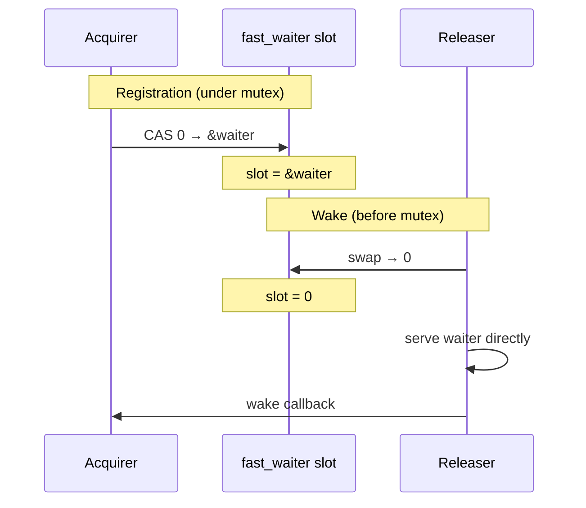
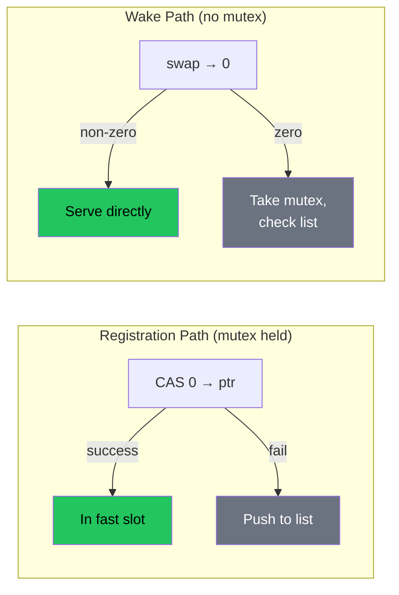

Volt's `Semaphore` and `Channel` both use an **atomic single-waiter fast slot** to bypass the mutex on the wake path when there is exactly one waiter. This pattern delivers a 2--3x speedup on contended benchmarks by turning the most common wake case (one waiter) into a single atomic swap.

This page documents the pattern, explains why it is correct (and why a superficially similar optimization deadlocked), and shows how it is applied in both primitives.

## The Problem

Both `Semaphore.release()` and `Channel.trySend()` need to wake blocked waiters. The standard approach is:

1. Take the waiter mutex.
2. Pop a waiter from the linked list.
3. Copy the waker.
4. Release the mutex.
5. Invoke the waker.

Under contention (e.g., 8 tasks contending on 2 semaphore permits), the mutex becomes a bottleneck. Every `release()` takes the lock even when there is only one waiter -- the common case.

## The Solution

Store the most recent waiter in an **atomic pointer slot** alongside the mutex-protected linked list. The releaser tries the slot first (lock-free), falling back to the mutex only if the slot is empty.

```
Registration (under mutex):           Wake (before mutex):
  CAS fast_waiter 0 → ptr               swap fast_waiter → 0
  If CAS fails: push to list             If non-zero: serve waiter directly
                                          If zero: take mutex, check list
```

The key insight is that `swap` atomically **consumes** the waiter pointer. There is no intermediate state where the waiter is registered but not reachable -- the swap is the transfer itself.





## Why It Is Not `has_waiters`

An earlier optimization attempted to add a `has_waiters` boolean flag to skip the mutex in `release()`. It deadlocked:

```
release()                              acquireWait()
─────────                              ─────────────
has_waiters.load() → false             permits.load() → 0
permits.fetchAdd(N)                    lock(mutex)
return                                 // sees permits=0 (stale)
                                       pushBack(waiter)
// Permits in atomic, waiter stuck     unlock(mutex)
// DEADLOCK
```

The flag was a **hint** -- `release()` read it and decided to skip the mutex, but permits had already been added to the atomic counter. The waiter queued under the lock never got served because `release()` had already returned.

The fast waiter slot is fundamentally different:

| Property | `has_waiters` (deadlocked) | `fast_waiter` (correct) |
|----------|---------------------------|------------------------|
| Type | Boolean flag | Pointer to waiter |
| Semantics | Hint ("someone might be waiting") | Transfer ("here is the waiter") |
| Release reads | Flag, then decides whether to take mutex | Swap consumes pointer atomically |
| Float window | Yes -- permits go to atomic while waiter is queued | No -- waiter is served directly via swap |
| Mutex skip | Skips mutex entirely based on flag | Skips mutex only for the consumed waiter |

## The Pattern in Detail

### Registration (acquirer side)

Registration happens under the mutex, after the acquirer has already failed the lock-free fast path:

```zig
// In Semaphore.acquireWaitDirect() — under self.mutex:
if (self.fast_waiter.cmpxchgStrong(0, @intFromPtr(waiter), .release, .monotonic) == null) {
    self.mutex.unlock();
    return false;  // Registered in fast slot
}
// Fast slot occupied — fall back to linked list
self.waiters.pushFront(waiter);
```

The CAS `0 → ptr` succeeds only if the slot is empty. If another waiter already occupies it, the new waiter goes to the linked list. This guarantees at most one waiter in the fast slot.

### Wake (releaser side)

The releaser tries the fast slot **before** taking the mutex:

```zig
// In Semaphore.release():
const fast_ptr = self.fast_waiter.swap(0, .acq_rel);
if (fast_ptr != 0) {
    const w: *Waiter = @ptrFromInt(fast_ptr);

    // CRITICAL: Copy waker BEFORE modifying state.
    // AcquireFuture may deinit the waiter after isComplete() returns true.
    const waker_fn = w.waker;
    const waker_ctx = w.waker_ctx;

    w.state.store(0, .release);  // Mark waiter as satisfied

    // Handle surplus permits
    if (surplus > 0) self.releaseSurplus(surplus);

    // Wake AFTER state is visible
    if (waker_fn) |wf| if (waker_ctx) |ctx| wf(ctx);
    return;
}

// Fast slot empty — fall back to mutex + linked list
self.mutex.lock();
// ...
```

The "copy before modify" pattern is critical for memory safety. Once `w.state.store(0, .release)` executes, the polling task may see `isComplete() == true` and immediately deinit the `AcquireFuture` (which owns the waiter). Reading `w.waker` after that would be use-after-free.

### Partial Permit Handling (Semaphore only)

When releasing fewer permits than the waiter needs:

```zig
// Partial: assign what we can, put waiter back
w.state.store(remaining - num, .release);
// Try fast slot first (commonly empty since we just swapped)
if (self.fast_waiter.cmpxchgStrong(0, @intFromPtr(w), .release, .monotonic) == null) {
    return;  // Back in fast slot, no wake needed
}
// Fast slot taken by new waiter — push to list under mutex
self.mutex.lock();
self.waiters.pushFront(w);
self.mutex.unlock();
```

## Use in Channel.zig

The channel uses two fast slots -- `fast_recv_waiter` and `fast_send_waiter` -- for the receive and send waiter paths respectively.

The pattern is identical to the semaphore, with one addition: the channel integrates with the **Dekker flag protocol** (`has_recv_waiters` / `has_send_waiters`). The fast slot handles the single-waiter fast path, while the Dekker flags remain for the general case (multiple waiters in the linked list).

```
trySend() fast path:
  1. Write value to ring buffer slot
  2. Check fast_recv_waiter (swap → 0): if non-zero, wake directly
  3. Check has_recv_waiters flag (seq_cst): if true, take mutex and wake from list

recvWait() slow path:
  1. Set has_recv_waiters = true (seq_cst)
  2. Re-check buffer (Dekker protocol)
  3. CAS fast_recv_waiter 0 → ptr (under mutex)
  4. If CAS fails: push to linked list
```

The fast slot and the Dekker flags serve different purposes:
- **Fast slot**: Transfers a specific waiter pointer (lock-free wake for single waiter)
- **Dekker flags**: Signal that waiters exist in the linked list (coordinates lock-free data path with blocking path)

## Use in Semaphore.zig

The semaphore uses a single `fast_waiter` field. Unlike the channel, it does not need Dekker flags because the semaphore's data path (`tryAcquire`) does not interact with a separate waiter-signaling mechanism -- the permits atomic counter and the waiter list are coordinated through the mutex.

Key differences from the channel:
- **Single slot** (not send/recv pair)
- **Partial permit handling**: Waiter may be put back into the slot after partial assignment
- **Cache-line alignment**: `permits` field is `align(std.atomic.cache_line)` to avoid false sharing with `fast_waiter` and the mutex under contention
- **`acquireWaitDirect`**: Skips the lock-free CAS fast path (used by `AcquireFuture.poll(.init)` which already called `tryAcquire()` and failed)

## Cancellation

Lock-free self-removal via CAS:

```zig
pub fn cancelAcquire(self: *Self, waiter: *Waiter) void {
    if (waiter.isComplete()) return;

    // Try lock-free removal from fast slot
    if (self.fast_waiter.cmpxchgStrong(
        @intFromPtr(waiter), 0, .acq_rel, .monotonic
    ) == null) {
        // Removed from fast slot — return partial permits
        const acquired = waiter.permits_requested - waiter.state.load(.monotonic);
        if (acquired > 0) self.release(acquired);
        return;
    }

    // Not in fast slot — must be in linked list (take mutex)
    self.mutex.lock();
    // ... remove from list, return partial permits ...
}
```

The CAS `ptr → 0` succeeds only if the waiter is still in the fast slot. If `release()` already swapped it out (or another waiter took the slot), the CAS fails and we fall back to the mutex path.

## Correctness Argument

Three invariants guarantee correctness:

1. **Single ownership**: `swap` returns a non-zero pointer to exactly one caller. Two concurrent `release()` calls cannot both extract the same waiter -- one gets the pointer, the other gets zero.

2. **No float window**: The swap IS the transfer mechanism. There is no intermediate state where the waiter is "registered" but the releaser can bypass it. Compare with `has_waiters`: the flag was separate from the actual waiter, creating a window where `release()` could see `has_waiters=false` while a waiter was being queued.

3. **Fallback safety**: If the fast slot CAS fails during registration (slot already occupied), the waiter goes to the linked list under the mutex. The standard mutex-protected path handles it correctly. The fast slot is an optimization layer on top of the existing correct algorithm.

## Performance Impact

The fast waiter slot eliminates mutex contention on the most common wake path:

| Primitive | Before | After | Improvement |
|-----------|--------|-------|-------------|
| Semaphore (8 tasks, 2 permits) | ~220 ns/op | ~139 ns/op | 1.6x faster |
| Channel MPMC (4P + 4C) | ~110 ns/op | ~73 ns/op | 1.5x faster |

In the semaphore contended benchmark, most `release()` calls find exactly one waiter (the common steady-state with 8 tasks and 2 permits). The fast slot serves this case with a single atomic swap instead of mutex lock + list pop + mutex unlock.

## When NOT to Use This Pattern

The fast waiter slot is not universally beneficial:

- **Many waiters typical**: The slot only helps with one waiter. If the linked list always has multiple waiters, the slot adds an extra atomic operation on every wake (swap that returns zero) before falling back to the mutex.
- **Wake path already lock-free**: If the wake mechanism is already lock-free (e.g., the Dekker flag check in `trySend()`), adding a fast slot adds complexity without saving the mutex cost.
- **Low contention**: Under low contention, the mutex is uncontended and nearly free (futex fast path). The fast slot's benefit is negligible.

The pattern shines when: (a) contention is high, (b) there is typically one waiter, and (c) the existing wake path requires a mutex.

### Source Files

- Semaphore: `src/sync/Semaphore.zig`
- Channel: `src/channel/Channel.zig`
- Channel wakeup protocol: [Channel Wakeup Protocol](/design/channel-wakeup-protocol/)
- Semaphore algorithm: [Semaphore Algorithm](/algorithms/semaphore-algorithm/)
