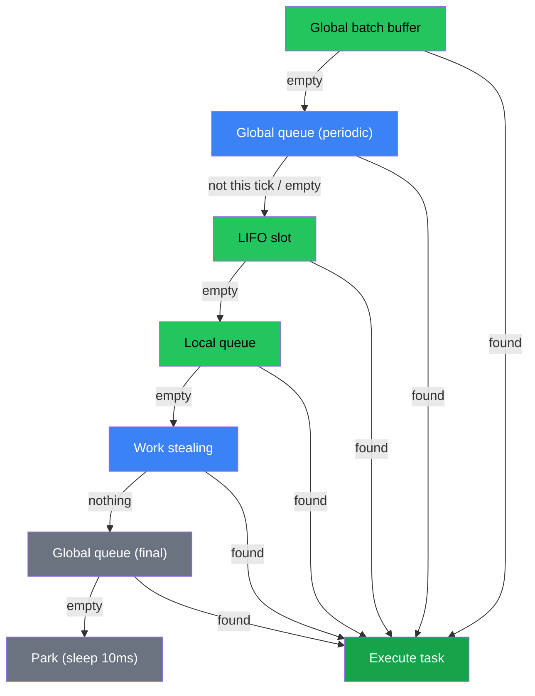
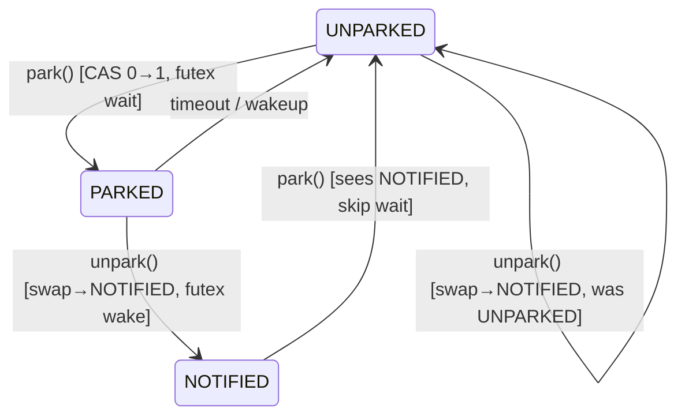

The scheduler is the heart of Volt. It distributes tasks across worker threads using a work-stealing algorithm derived from Tokio's multi-threaded scheduler.

Source: `src/internal/scheduler/Scheduler.zig`

## Per-worker resources

Each worker thread owns:

| Resource | Description |
|----------|-------------|
| **LIFO slot** | Single-task hot cache for the newest scheduled task |
| **Local queue** | 256-slot lock-free ring buffer (WorkStealQueue) |
| **Global batch buffer** | 32 pre-fetched tasks from the global queue |
| **Park state** | Futex-based sleep/wake mechanism |
| **Cooperative budget** | 128 polls per tick before yielding |
| **PRNG** | xorshift64+ for randomized steal victim selection |
| **EWMA timer** | Adaptive global queue check interval |

## Work-finding priority

When a worker needs a task, it searches in this order:

```
1. Global batch buffer   -- Already-fetched tasks (no lock needed)
       |
       v (empty)
2. Global queue          -- Periodic batch fetch (adaptive interval)
       |                    Checked BEFORE local queue to prevent starvation
       v (not this tick / empty)
3. LIFO slot             -- Newest scheduled task (cache-hot)
       |
       v (empty)
4. Local queue           -- Own ring buffer (FIFO pop)
       |
       v (empty)
5. Work stealing         -- Steal half from another worker's queue
       |
       v (nothing found)
6. Global queue (final)  -- One more check before parking
       |
       v (empty)
7. Park                  -- Sleep with 10ms timeout until woken
```

The periodic global queue check (step 2) runs before the local queue (steps 3-4). This prevents starvation: fast-cycling tasks in the LIFO slot (e.g., channel producer/consumer ping-pong) can keep local work perpetually available, starving tasks in the global queue. Checking the global queue first on periodic ticks ensures all tasks get serviced. This matches Tokio's injector queue priority.



## WorkStealQueue (lock-free ring buffer)

Source: `src/internal/scheduler/Header.zig`

The local queue is a 256-slot lock-free ring buffer based on the Chase-Lev work-stealing deque. It supports three operations with different thread-safety guarantees.

### Layout

```
Capacity: 256 slots (compile-time constant)

Head: packed u32 = { steal_head: u16, real_head: u16 }
Tail: atomic u32
Slots: [256]atomic(?*Header)

Cache-line aligned:
  head  ──────────────>  [128-byte boundary]
  tail  ──────────────>  [128-byte boundary]
  slots ──────────────>  [128-byte boundary]
```

The head is packed into a single `u32` with two 16-bit halves:

- **real_head** -- The true consumer position (only the owner reads here).
- **steal_head** -- The position up to which stealers have claimed slots.

This two-head design allows the owner to pop from `real_head` while stealers concurrently steal from `steal_head`, without the two operations conflicting.

### Producer (owner thread only)

`push(task, global_queue)`:

1. Write task to `slots[tail % 256]`.
2. Increment tail.
3. If full, **overflow**: move 128 tasks to the global queue in a single batch, freeing space.

Push is wait-free for the common case. Overflow amortizes global queue lock cost over 128 tasks.

### Consumer (owner thread only)

`pop()`:

1. Read `real_head`.
2. If `real_head == tail`, queue is empty -- return null.
3. Load `slots[real_head % 256]`.
4. CAS the packed head to advance `real_head` by 1.
5. Return the task.

### Stealer (any thread)

`stealInto(source, dest)` -- 3-phase steal of half the queue:

1. **Claim**: CAS `source.head` to advance `real_head` by half, keeping `steal_head` unchanged. This reserves tasks for the stealer.
2. **Copy**: Copy claimed tasks from the source buffer to the destination buffer. The first stolen task is returned directly.
3. **Release**: CAS `source.head` to advance `steal_head` to match `real_head`, signaling completion. If this CAS fails (source popped concurrently), the steal is abandoned.

The 3-phase protocol ensures correctness without locks. At most one steal can succeed at a time per victim (the claim CAS serializes stealers).

## LIFO slot

The LIFO slot is a single atomic pointer separate from the ring buffer. It exploits temporal locality: a task that was just woken is likely to have hot cache lines, so executing it immediately is faster than queueing it.

### Eviction pattern

When a new task is scheduled on a worker:

```
Push task T3:
  LIFO: [T2] --> LIFO: [T3], ring buffer: [..., T2]
```

The new task always goes into the LIFO slot. If the slot was occupied, the old task is evicted to the ring buffer.

### Starvation prevention

LIFO polls are capped at `MAX_LIFO_POLLS_PER_TICK = 3` per tick. After 3 consecutive LIFO executions, the worker flushes the LIFO slot to the ring buffer so its task becomes visible to FIFO ordering and to stealers.

### Lost wakeup prevention

The LIFO slot interacts with the parking mechanism through the `transitioning_to_park` flag:

1. Before parking, the worker sets `transitioning_to_park = true`.
2. `tryScheduleLocal()` checks this flag. If set, it returns false, forcing the caller to use the global queue.
3. This prevents the race where a task is pushed into a LIFO slot just as the worker is about to sleep.

```zig
pub fn tryScheduleLocal(self: *Self, task: *Header) bool {
    // CRITICAL: Check transitioning flag to prevent lost wakeup
    if (self.transitioning_to_park.load(.acquire)) {
        return false;
    }

    // Evict old LIFO task to run_queue, put new task in LIFO
    if (self.lifo_slot.swap(task, .acq_rel)) |prev| {
        self.run_queue.push(prev, &self.scheduler.global_queue);
    }
    return true;
}
```

## Global queue

The global injection queue is a mutex-protected intrusive linked list with an atomic length counter for lock-free emptiness checks.

### Batch fetch

Workers pull from the global queue in batches to amortize lock acquisition cost:

```
Batch size = min(global_len / num_workers, MAX_GLOBAL_QUEUE_BATCH_SIZE)
Minimum:    4 tasks
Default:    32 tasks
Maximum:    64 tasks
```

The fair-share formula `len / num_workers` prevents one worker from draining the entire global queue.

Fetched tasks are stored in the worker's `global_batch_buffer` (32 slots). Subsequent `findWork()` calls check this buffer first (step 1 in the priority order), avoiding the global queue lock entirely until the buffer is exhausted.

### Adaptive check interval

Workers do not check the global queue on every tick. The interval adapts based on task duration using EWMA:

```
new_avg = (current_avg * 0.1) + (old_avg * 0.9)
interval = clamp(TARGET_LATENCY / avg_task_ns, 8, 255)
```

| Task duration | Global queue interval |
|---------------|----------------------|
| 1us | 255 (max -- check rarely) |
| 10us | 100 |
| 50us (default) | 20 |
| 100us | 10 |
| 1ms+ | 8 (min -- check frequently) |

Target latency is 1ms. Short tasks lead to infrequent checks (the global queue has time to accumulate). Long tasks lead to frequent checks (to prevent starvation).

## Worker parking and the "Last Searcher Must Notify" protocol

When a worker has no work, it parks using a futex-based mechanism. The parking protocol prevents lost wakeups through a bitmap-based coordination system.

### IdleState

```zig
pub const IdleState = struct {
    num_searching: atomic(u32),    // Workers actively looking for work
    num_parked: atomic(u32),       // Workers sleeping
    parked_bitmap: atomic(u64),    // Bit per worker: 1=parked, 0=running
    num_workers: u32,
};
```

### The protocol

1. **Task enqueue**: When a task is enqueued and `num_searching == 0`, one parked worker is claimed from the bitmap (using `@ctz` for O(1) lookup) and woken. It enters the "searching" state.

2. **Searcher finds work**: When a searching worker finds a task, it calls `transitionWorkerFromSearching()`. If it was the LAST searcher (`num_searching` goes to 0), it wakes another parked worker. This chain reaction ensures all queued tasks get processed.

3. **Searcher parks**: If a searching worker exhausts all sources, it decrements `num_searching` when parking. If it was the last searcher, it does a final check of all queues.

### Searcher limiting

At most ~50% of workers can be in the searching state simultaneously:

```zig
pub fn tryBecomeSearcher(self, num_workers) bool {
    if (2 * num_searching >= num_workers) return false;
    num_searching += 1;
    return true;
}
```

This prevents thundering herd when work appears after an idle period.

### Park state (futex-based)

```zig
pub const ParkState = struct {
    futex: atomic(u32),  // UNPARKED=0, PARKED=1, NOTIFIED=2

    fn park(timeout_ns) {
        if (cmpxchg(UNPARKED -> PARKED)) {
            futex.timedWait(PARKED, timeout_ns);
        }
        futex.store(UNPARKED);
    }

    fn unpark() {
        prev = futex.swap(NOTIFIED);
        if (prev == PARKED) futex.wake(1);
    }
};
```



Park timeout is 10ms. Worker 0 may use a shorter timeout based on the next timer expiration. On wake, the worker checks whether it was claimed by a notification (bitmap bit cleared) or woke from timeout (bitmap bit still set).

## Cooperative budgeting

Volt has two layers of cooperative budgeting, matching Tokio's design:

### Budget per task (Context.pollProceed)

Each task gets a budget of 128 operations per poll. Futures that loop internally (e.g., lock → unlock → lock in a tight loop) call `ctx.pollProceed()` before each operation. When the budget reaches zero, `pollProceed()` returns false and the future returns `.pending`.

Budget-exhausted tasks produce a `.yield` poll result (distinct from `.pending`). The scheduler routes yielded tasks to the **global queue** instead of the LIFO slot, ensuring they don't immediately re-consume the same worker and starve other tasks.

```zig
// In Context (src/future/Waker.zig):
pub fn pollProceed(self: *Context) bool {
    if (self.budget == 0) {
        self.budget_exhausted = true;
        return false;
    }
    self.budget -= 1;
    return true;
}
```

Users writing custom tight-loop futures should call `ctx.pollProceed()` on each iteration -- this is equivalent to Tokio's `consume_budget().await`.

### Budget per tick (worker level)

Each worker has a budget of 128 polls per tick. After exhausting the budget:

1. The budget resets to 128.
2. The tick counter increments.
3. The adaptive interval is recalculated.
4. Timer and I/O maintenance runs.

### Worker run loop

```zig
fn run(self: *Self) void {
    while (!self.scheduler.shutdown.load(.acquire)) {
        self.tick +%= 1;
        self.batch_start_ns = std.time.nanoTimestamp();

        // Poll timers (worker 0 only)
        if (self.index == 0) _ = self.scheduler.pollTimers();

        // Poll I/O (all workers, non-blocking tryLock)
        _ = self.scheduler.pollIo();

        // Run tasks until budget exhausted
        var tasks_run: u32 = 0;
        while (self.budget > 0) {
            if (self.findWork()) |task| {
                self.executeTask(task);
                self.budget -|= 1;
                tasks_run += 1;
            } else break;
        }

        // Update adaptive interval
        self.updateAdaptiveInterval(tasks_run);

        // Reset for next tick
        self.budget = BUDGET_PER_TICK;
        self.lifo_polls_this_tick = 0;

        if (tasks_run == 0) self.parkWorker();
    }
}
```

## Statistics

The scheduler tracks per-worker and global statistics accessible through `scheduler.getStats()`:

```zig
pub const Stats = struct {
    total_spawned: u64,    // Total tasks ever spawned
    total_polled: u64,     // Total poll() calls across all workers
    total_stolen: u64,     // Total work-stealing operations
    total_parked: u64,     // Total times workers parked
    num_workers: usize,
};
```

Per-worker stats include `tasks_polled`, `tasks_stolen`, `times_parked`, `lifo_hits`, and `global_batch_fetches`.

## Comparison with Tokio

| Feature | Volt | Tokio |
|---------|----------|-------|
| Worker wake | O(1) bitmap + `@ctz` | Linear search |
| LIFO slot | Yes (with eviction) | Yes |
| Local queue | 256-slot lock-free ring | 256-slot lock-free ring |
| Global batch | 32-task buffer | Batch fetch |
| Cooperative budget | 128 ops/task + 128 polls/tick | 128 ops/task + budget/tick |
| Adaptive interval | EWMA-based | Fixed interval |
| Searcher limiting | ~50% cap | ~50% cap |
| Park mechanism | Futex with timeout | Condvar |
| Task state | 64-bit packed atomic | 64-bit packed atomic |

## Work-stealing join

When `JoinHandle.join()` is called, the runtime avoids spinning or blocking by executing other tasks while waiting for the target to complete.

### Worker threads: `helpUntilComplete`

When `join()` is called from a worker thread, the worker enters `helpUntilComplete(target)`. Instead of sleeping, it saves the current task header and runs the normal work-finding loop -- LIFO slot, local queue, global queue, work stealing -- until the target task's `isComplete()` returns true.

Because `Runtime.spawn()` detects worker context and calls `spawnFromWorker()` to place the task in the LIFO slot, the spawned task typically sits in the same worker's LIFO slot at the time `helpUntilComplete` runs. The worker pops it immediately and executes it inline. For serial spawn+await patterns, this means near-zero scheduling overhead.

### Non-worker threads: `blockOnComplete`

When `join()` is called from a non-worker thread (e.g., the main thread), `blockOnComplete(target)` pulls tasks from the global injection queue and executes them inline. This ensures progress even when no worker thread is free to run the target task.

### Multi-target waiting: `helpUntilAnyComplete` / `blockOnAnyComplete`

The `race()` and `select()` combinators need to wait for **any one** of multiple tasks to complete. These variants accept a `[]const *Header` slice and check all targets each iteration, returning as soon as any target's `isComplete()` returns true. The same work-finding loop (LIFO slot, local queue, global queue, work stealing, I/O polling) runs between checks, ensuring all tasks make progress concurrently.

### Performance impact

This optimization reduced spawn+await latency from ~20,000 ns to ~6,700 ns, making it competitive with Tokio's ~8,000 ns for the same pattern. The key insight is that the LIFO slot + `spawnFromWorker` + `helpUntilComplete` chain turns a spawn+await into effectively an inline function call with a small constant overhead for task setup.

### `spawnFromWorker`

`Runtime.spawn()` checks `getCurrentWorkerIndex()` to detect whether the caller is on a worker thread. If so, it calls `spawnFromWorker(worker_idx, task)` which routes the task to the worker's LIFO slot via `tryScheduleLocal()`, bypassing the global queue entirely. This is what enables `helpUntilComplete` to find the task immediately. If the worker is transitioning to park, the task falls back to the global queue to prevent lost wakeups.
