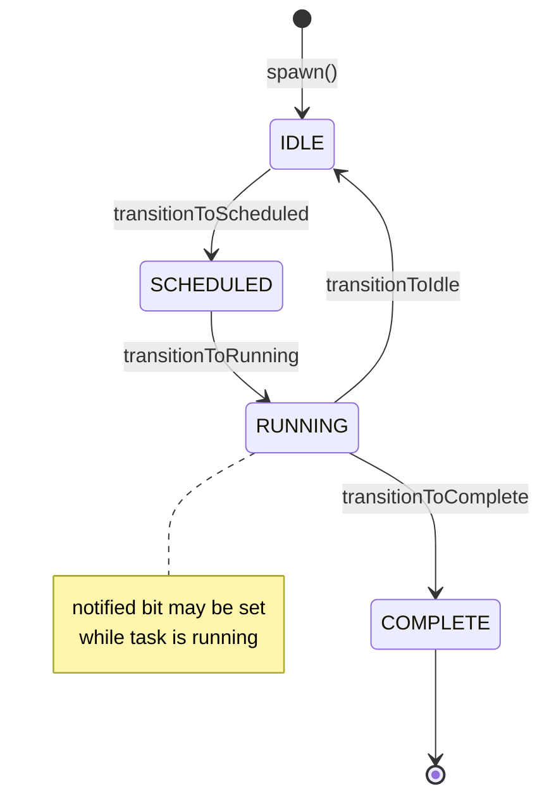
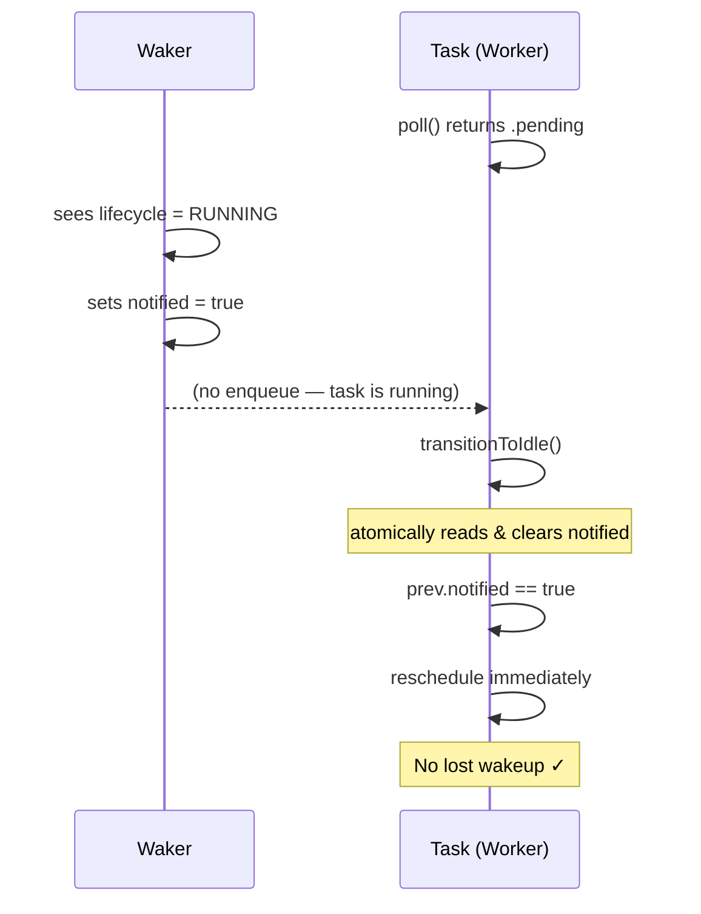

Every task in Volt is tracked by a type-erased `Header` with a 64-bit packed atomic state word. All state transitions use CAS loops with `acq_rel` / `acquire` ordering. This design is directly modeled after Tokio's task state machine.

Source: `src/internal/scheduler/Header.zig`

## State layout

The 64-bit state word is a Zig `packed struct(u64)`:

```
 63                  40  39       32  31     24  23     16  15      0
+----------------------+-----------+---------+-----------+----------+
|    ref_count (24)    | shield(8) | flags(8)| lifecycle | reserved |
+----------------------+-----------+---------+-----------+----------+
```

```zig
pub const State = packed struct(u64) {
    _reserved: u16 = 0,

    lifecycle: Lifecycle = .idle,  // 8 bits

    // Flags (8 bits)
    notified: bool = false,
    cancelled: bool = false,
    join_interest: bool = false,
    detached: bool = false,
    _flag_reserved: u4 = 0,

    shield_depth: u8 = 0,         // Cancellation shield counter
    ref_count: u24 = 1,           // Up to 16 million references
};
```

### Fields

**ref_count** (24 bits) -- Reference counting for memory safety. Incremented on spawn and waker clone, decremented on drop and waker drop. When it reaches zero, the task is freed. Maximum 16 million references.

**shield_depth** (8 bits) -- Cancellation shield counter. While greater than 0, cancellation is deferred. Protects critical sections from partial execution.

**flags** (8 bits):
- `notified` -- A waker fired while the task was Running or Scheduled.
- `cancelled` -- Cancellation was requested.
- `join_interest` -- A `Future(T)` (user-facing) / `JoinHandle` (engine internal) is waiting for the result.
- `detached` -- The handle was detached (no one will collect the result).

**lifecycle** (8 bits) -- Current execution state (see transitions below).

## Lifecycle states

```
                    spawn()
        +---------- IDLE --------+
        |            ^           |
        |            |           |
        v       transitionToIdle |
    SCHEDULED        |           |
        |            |           |
        |  transitionToRunning   |
        +------> RUNNING -------+
                     |
                     | transitionToComplete
                     v
                  COMPLETE
```



| State | Meaning |
|-------|---------|
| **IDLE** | Not scheduled. Waiting for I/O, timer, or sync primitive wake. |
| **SCHEDULED** | In a run queue. Waiting for a worker to execute it. |
| **RUNNING** | Currently being polled by a worker. |
| **COMPLETE** | Future returned `.ready`. Result available via `Future(T)` (user-facing) / `JoinHandle` (engine internal). |

## State transitions

All transitions are implemented as CAS loops that atomically read the current state, modify the relevant fields, and attempt to swap in the new value.

### transitionToScheduled

Called when a waker fires or when a task is initially spawned.

```
Input state     Action                          Returns
-----------     ------                          -------
IDLE            Set lifecycle = SCHEDULED       true (caller must queue)
RUNNING         Set notified = true             false (task is running)
SCHEDULED       Set notified = true             false (already queued)
COMPLETE        No change                       false (task is done)
```

This is the core wakeup primitive. The return value tells the caller whether the task needs to be enqueued.

```zig
pub fn transitionToScheduled(self: *Header) bool {
    while (true) {
        const current = State.fromU64(self.state.load(.acquire));

        var next = current;
        switch (current.lifecycle) {
            .idle => {
                next.lifecycle = .scheduled;
                next.notified = false;
            },
            .running, .scheduled => {
                next.notified = true;
            },
            .complete => return false,
        }

        if (self.state.cmpxchgWeak(
            current.toU64(), next.toU64(), .acq_rel, .acquire
        ) == null) {
            return current.lifecycle == .idle;
        }
    }
}
```

### transitionToRunning

Called by a worker when it picks up a scheduled task.

```
SCHEDULED -> RUNNING
```

Returns `false` if the task was cancelled or not in SCHEDULED state.

### transitionToIdle

Called after `poll()` returns `.pending`. This is the critical path for the wakeup protocol.

```
RUNNING -> IDLE (atomically clears notified, returns previous state)
```

```zig
pub fn transitionToIdle(self: *Header) State {
    while (true) {
        const current = State.fromU64(self.state.load(.acquire));

        var next = current;
        next.lifecycle = .idle;
        next.notified = false;  // Clear the notified bit

        if (self.state.cmpxchgWeak(
            current.toU64(), next.toU64(), .acq_rel, .acquire
        ) == null) {
            return current;  // Return PREVIOUS state (with notified bit)
        }
    }
}
```

The caller inspects `prev.notified`. If true, the task must be immediately rescheduled.

### transitionToComplete

Called when `poll()` returns `.complete`.

```
RUNNING -> COMPLETE
```

If `join_interest` is set, the `Future(T)` handle (internally `JoinHandle`) is woken. If `detached` is set, the task can be freed immediately.

## The wakeup protocol

The `notified` bit is the sole signal for "task needs to be polled again." This single-bit protocol prevents lost wakeups that plagued an earlier design with separate `waiting` and `notified` flags.

### The critical path

```
1. Waker fires while task is IDLE:
   - transitionToScheduled() returns true
   - Caller enqueues task to run queue

2. Waker fires while task is RUNNING:
   - transitionToScheduled() sets notified = true, returns false
   - Task continues executing

3. Task's poll() returns .pending:
   - transitionToIdle() atomically clears notified, returns prev state
   - If prev.notified was true:
       - Task is immediately rescheduled (no lost wakeup)
   - If prev.notified was false:
       - Task waits for external event

4. Waker fires while task is SCHEDULED:
   - transitionToScheduled() sets notified = true, returns false
   - Task will re-check notified after next poll
```

### Why this prevents lost wakeups

The dangerous scenario: a waker fires between `poll()` returning `.pending` and the task transitioning to IDLE. In this window:

- The waker sees lifecycle = RUNNING, so it sets `notified = true` and returns false (does not enqueue).
- The task then calls `transitionToIdle()`, which atomically reads and clears `notified`.
- Since `prev.notified` was true, the task immediately reschedules itself.

Without atomic clearing, there would be a TOCTOU race between checking `notified` and entering IDLE.



## Reference counting

The 24-bit reference count tracks ownership across the system:

| Event | Effect |
|-------|--------|
| Spawn | ref = 1 (scheduler holds initial reference) |
| `Future(T)` / `JoinHandle` created | ref + 1 |
| Waker cloned | ref + 1 |
| Waker dropped | ref - 1 |
| `Future(T)` / `JoinHandle` dropped | ref - 1 |
| Task completes | ref - 1 (scheduler releases) |
| ref reaches 0 | Task is deallocated |

```zig
pub fn ref(self: *Header) void {
    const prev = self.state.fetchAdd(State.REF_ONE, .monotonic);
    // REF_ONE = 1 << 40 (the ref_count field starts at bit 40)
}

pub fn unref(self: *Header) bool {
    const prev = self.state.fetchSub(State.REF_ONE, .acq_rel);
    const state = State.fromU64(prev);
    return state.ref_count == 1;  // Was 1, now 0
}
```

When `unref()` returns true (ref count reached zero), the caller invokes `task.drop()` through the vtable.

## Shield-based cancellation

Shield depth (8 bits, 0--255) implements deferred cancellation:

```zig
pub fn addShield(self: State) State {
    var s = self;
    if (s.shield_depth < 255) s.shield_depth += 1;
    return s;
}

pub fn isCancellationEffective(self: State) bool {
    return self.cancelled and self.shield_depth == 0;
}
```

When a task calls `addShield()`, the shield depth increments. While depth is greater than zero, `isCancellationEffective()` returns false even if the `cancelled` flag is set. When `removeShield()` brings the depth back to zero, cancellation takes effect.

This protects critical sections. For example, a database transaction commit should not be interrupted mid-way:

```zig
// Inside a task's poll function:
header.addShieldAtomic();
defer header.removeShieldAtomic();
// ... critical section that must complete atomically ...
```

## Type erasure

Tasks are type-erased through a vtable so the scheduler only handles `*Header` pointers:

```zig
pub const VTable = struct {
    poll: *const fn (*Header) PollResult_,
    drop: *const fn (*Header) void,
    schedule: *const fn (*Header) void,
    reschedule: *const fn (*Header) void,
};
```

`FutureTask(F)` wraps any Future type into a concrete task:

```zig
pub fn FutureTask(comptime F: type) type {
    return struct {
        header: Header,           // Must be first field for @fieldParentPtr
        future: F,                // The user's future (state machine)
        result: ?F.Output,        // Result storage
        allocator: Allocator,
        scheduler: ?*anyopaque,
        schedule_fn: ?*const fn (*anyopaque, *Header) void,
        reschedule_fn: ?*const fn (*anyopaque, *Header) void,
    };
}
```

The scheduler dispatches to the concrete implementation via `@fieldParentPtr`:

```zig
fn pollImpl(header: *Header) PollResult_ {
    const self: *FutureTask(F) = @fieldParentPtr("header", header);
    // Poll self.future...
}
```

## Waker design

Wakers are 16-byte value types (pointer + vtable pointer) that know how to reschedule their associated task:

```zig
pub const Waker = struct {
    raw: RawWaker,
};

pub const RawWaker = struct {
    data: *anyopaque,      // Pointer to Header
    vtable: *const VTable,

    pub const VTable = struct {
        wake: *const fn (*anyopaque) void,         // Consume and wake
        wake_by_ref: *const fn (*anyopaque) void,  // Wake without consuming
        clone: *const fn (*anyopaque) RawWaker,     // Clone (ref++)
        drop: *const fn (*anyopaque) void,          // Drop (ref--)
    };
};
```

`wake()` calls `header.schedule()` which invokes `transitionToScheduled()`. If the task transitions from IDLE to SCHEDULED, the schedule callback pushes it to the current worker's LIFO slot (if on a worker thread) or the global queue (otherwise).

## Intrusive list pointers

Each Header contains `next` and `prev` pointers for intrusive linked lists:

```zig
pub const Header = struct {
    state: std.atomic.Value(u64),
    next: ?*Header = null,
    prev: ?*Header = null,
    vtable: *const VTable,
};
```

These are used by the global injection queue (singly-linked) and sync primitive waiter queues. Because the list pointers are embedded in the task header itself, there is zero allocation overhead for queue operations.

## Work-stealing join and the state machine

When `JoinHandle.join()` is called, the runtime uses `helpUntilComplete` (on worker threads) or `blockOnComplete` (on non-worker threads) to execute other tasks while waiting. This interacts with the state machine as follows:

1. The worker saves the current `current_header` thread-local (the calling task's header).
2. The worker enters a loop that calls `findWork()` and `executeTask()` -- the same path as the normal run loop. Each executed task goes through the full IDLE -> SCHEDULED -> RUNNING -> (IDLE or COMPLETE) lifecycle.
3. After each task execution, the worker checks `target.isComplete()` on the join target. This reads the `lifecycle` field from the target's packed atomic state word. If `lifecycle == .complete`, the join is satisfied.
4. The worker restores the saved `current_header`, so the calling task resumes with correct thread-local context.

Because `spawnFromWorker` places the target task in the LIFO slot, `helpUntilComplete` typically finds and executes the target on its first iteration -- the state machine transitions from SCHEDULED to RUNNING to COMPLETE happen inline within the join call.
