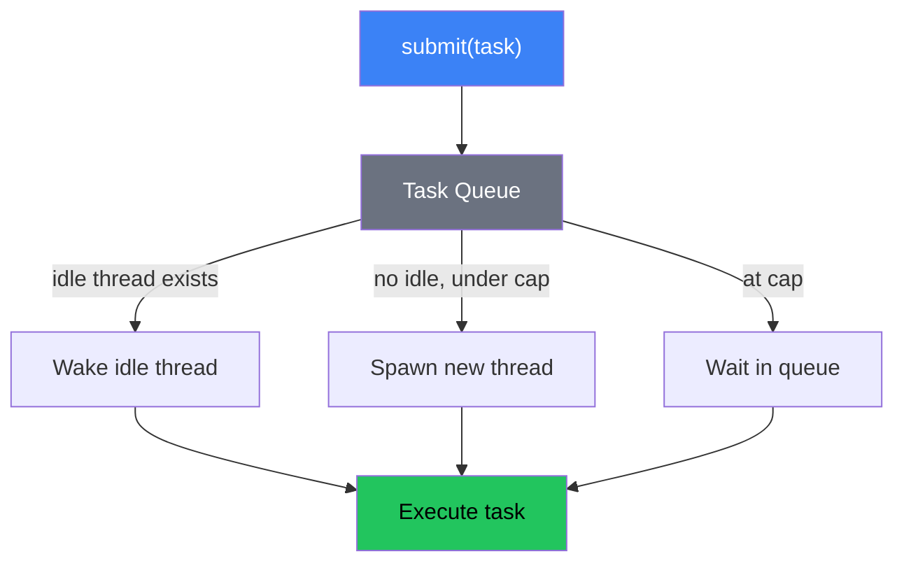
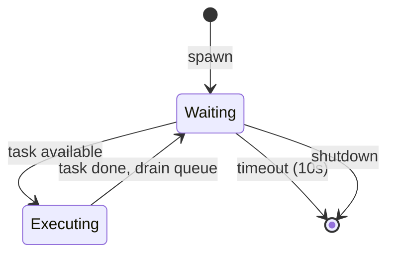

The blocking pool handles CPU-intensive or synchronous blocking work on dedicated threads, separate from the async I/O workers. This prevents blocking operations from starving async tasks.

Source: `src/internal/blocking.zig`

## Why a separate pool

The async scheduler's worker threads are designed to run non-blocking futures. If a task performs blocking I/O (e.g., reading a file synchronously) or CPU-intensive work (e.g., hashing, compression), it blocks the entire worker thread, preventing other tasks from executing.

The blocking pool provides dedicated threads for this kind of work. Each blocking thread runs a single operation to completion, then either picks up the next queued task or idles.

## Design

```
+--------------------------------------------------+
|  Blocking Pool                                    |
|                                                   |
|  +-----------+  +-----------+  +-----------+      |
|  | Thread 1  |  | Thread 2  |  | Thread N  |      |
|  | (active)  |  | (idle)    |  | (active)  |      |
|  +-----------+  +-----------+  +-----------+      |
|                                                   |
|  Queue: [Task] -> [Task] -> [Task] -> nil         |
|  (intrusive singly-linked list)                   |
|                                                   |
|  Mutex + Condvar for synchronization              |
+--------------------------------------------------+
```



### Key properties

* **Dynamic scaling**: Threads spawn on demand, up to a configurable cap (default: 512).
* **Idle timeout**: Threads exit after 10 seconds of inactivity.
* **Intrusive task queue**: Zero-allocation task dispatching.
* **Spurious wakeup handling**: A `num_notify` counter ensures correct wakeup behavior.
* **Self-cleanup**: Exiting threads join the previous exiting thread, preventing handle leaks.

## Configuration

```zig
pub const Config = struct {
    /// Maximum threads to spawn (default: 512).
    thread_cap: usize = 512,

    /// Idle timeout before threads exit (nanoseconds).
    /// Default: 10 seconds.
    keep_alive_ns: u64 = 10 * std.time.ns_per_s,
};
```

From the top-level `Runtime.Config`:

```zig
pub const Config = struct {
    max_blocking_threads: usize = 512,
    blocking_keep_alive_ns: u64 = 10 * std.time.ns_per_s,
    // ...
};
```

## Thread spawning strategy

When `submit()` is called:

1. The task is added to the intrusive task queue.
2. If there are idle threads, one is notified via the condvar.
3. If there are no idle threads and the thread count is below the cap, a new thread is spawned.
4. If the thread count is at the cap, the task waits in the queue for a thread to become available.

```zig
pub fn submit(self: *Self, task: *Task) error{PoolShutdown}!void {
    self.mutex.lock();
    defer self.mutex.unlock();

    if (self.shared.shutdown) return error.PoolShutdown;

    // Enqueue task (intrusive list append)
    task.next = null;
    if (self.shared.queue_tail) |tail| {
        tail.next = task;
    } else {
        self.shared.queue_head = task;
    }
    self.shared.queue_tail = task;

    if (self.metrics.numIdleThreads() == 0) {
        if (self.metrics.numThreads() < self.thread_cap) {
            // Spawn new thread
            const thread = std.Thread.spawn(.{}, workerLoop, .{self, id});
            // ...
        }
    } else {
        // Wake an idle thread
        self.shared.num_notify += 1;
        self.condvar.signal();
    }
}
```

## Thread lifecycle

Each blocking thread runs a loop:

```
Spawn
  |
  v
+-----------+
| Wait for  | <-- condvar.timedWait(keep_alive_ns)
| task      |
+-----+-----+
      |
      +-- task available --> Execute task --> loop back to Wait
      |
      +-- timeout (10s) --> Exit thread
      |
      +-- shutdown --> Exit thread
```



### Idle timeout

When a thread wakes from `condvar.timedWait()` without a task, it checks whether the timeout was reached. If so, it exits. Before exiting, it joins the previous exiting thread (chain-join pattern) to prevent thread handle leaks:

```zig
// Each exiting thread joins the previous one
if (shared.last_exiting_thread) |prev| {
    prev.join();
}
shared.last_exiting_thread = std.Thread.getCurrentThread();
```

This ensures proper resource cleanup without requiring the pool to track and join every thread individually.

### Spurious wakeup handling

The `num_notify` counter prevents threads from treating spurious condvar wakeups as real notifications:

```zig
// In the worker loop:
while (self.shared.queue_head == null and !self.shared.shutdown) {
    if (self.shared.num_notify > 0) {
        self.shared.num_notify -= 1;
        break;  // Legitimate wakeup
    }
    // Wait with timeout
    self.condvar.timedWait(&self.mutex, keep_alive_ns)
        catch break;  // Timeout
}
```

Each `submit()` increments `num_notify` by 1 and signals the condvar. Each waking thread decrements `num_notify` by 1 before proceeding. If a thread wakes spuriously (condvar without notify), it goes back to waiting.

## Task interface

Tasks submitted to the blocking pool implement a simple function-pointer interface:

```zig
pub const Task = struct {
    /// Function to execute.
    func: *const fn (*Task) void,

    /// Next task in queue (intrusive list).
    next: ?*Task = null,

    /// Whether this task must run even during shutdown.
    mandatory: bool = false,
};
```

The `func` callback receives a pointer to the Task itself. Callers embed the Task in a larger struct and use `@fieldParentPtr` to recover their context:

```zig
const MyWork = struct {
    task: blocking.Task,
    data: []const u8,
    result: ?[]u8 = null,

    fn execute(task_ptr: *blocking.Task) void {
        const self: *MyWork = @fieldParentPtr("task", task_ptr);
        self.result = doExpensiveWork(self.data);
    }
};
```

## Integration with the async scheduler

The `Io` handle exposes blocking/CPU-intensive operations through `concurrent()`:

```zig
// From inside async context (io: volt.Io):
const hash_handle = try io.concurrent(computeHash, .{data});
const hash = try hash_handle.wait();
```

Under the hood, `concurrent()`:

1. Allocates a `FnPayload` struct that captures the function and arguments.
2. Wraps it in a `blocking.Task` with the execute callback.
3. Submits it to the blocking pool via `pool.submit()`.
4. Returns a handle that the caller can use to wait for the result.

When the blocking task completes, it signals the associated async task's waker, which causes the scheduler to reschedule the waiting future.

## Metrics

The blocking pool provides lock-free metrics through atomic counters:

```zig
pub const Metrics = struct {
    num_threads: atomic(usize),       // Current thread count
    num_idle_threads: atomic(usize),  // Idle threads
    queue_depth: atomic(usize),       // Pending tasks in queue
};
```

These can be read without taking the mutex, making them suitable for monitoring dashboards and health checks.

## Shutdown

During `Runtime.deinit()`, the blocking pool shuts down in order:

1. Set `shutdown = true` under the mutex.
2. Broadcast the condvar to wake all waiting threads.
3. Take ownership of all thread handles.
4. Release the mutex.
5. Join all threads outside the lock (preventing deadlock).
6. Clean up shared state.

```zig
pub fn deinit(self: *Self) void {
    {
        self.mutex.lock();
        defer self.mutex.unlock();

        self.shared.shutdown = true;
        self.condvar.broadcast();

        // Take ownership of thread handles
        workers_to_join = self.shared.worker_threads;
        self.shared.worker_threads = .{};
    }

    // Join outside the lock
    var iter = workers_to_join.iterator();
    while (iter.next()) |entry| {
        entry.value_ptr.*.join();
    }
}
```

Tasks still in the queue when shutdown begins are dropped. Tasks marked as `mandatory` are executed before shutdown completes.
