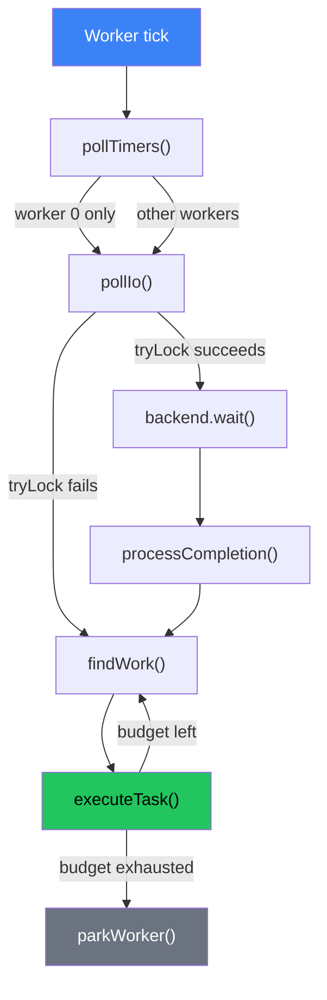

The I/O driver abstracts platform-specific async I/O backends behind a unified interface. The scheduler owns the I/O backend and polls for completions on each tick.

Source: `src/internal/backend.zig`

## Backend selection

Volt automatically selects the best available I/O backend for the current platform:

| Platform | Primary backend | Fallback |
|----------|----------------|----------|
| Linux 5.1+ | io\_uring | epoll |
| Linux \< 5.1 | epoll | poll |
| macOS 10.12+ | kqueue | poll |
| Windows 10+ | IOCP | -- |
| Other | poll | -- |

Backend selection is automatic by default (`backend_type: ?BackendType = null`) or can be forced via configuration:

```zig
var io = try Io.init(allocator, .{
    .backend = .kqueue,  // Force kqueue even if io_uring is available
});
```

The available backend types are:

```zig
pub const BackendType = enum {
    auto,      // Best for platform (default)
    io_uring,  // Linux 5.1+
    epoll,     // Linux (fallback)
    kqueue,    // macOS/BSD
    iocp,      // Windows
    poll,      // Universal fallback
};
```

## Unified backend interface

All backends expose the same interface through a tagged union:

```zig
pub const Backend = union(BackendType) {
    auto: void,
    io_uring: io_uring.IoUring,
    epoll: epoll.Epoll,
    kqueue: kqueue.Kqueue,
    iocp: iocp.Iocp,
    poll: poll.Poll,

    pub fn init(allocator: Allocator, config: Config) !Backend { ... }
    pub fn deinit(self: *Backend) void { ... }
    pub fn submit(self: *Backend, op: Operation) !SubmissionId { ... }
    pub fn wait(self: *Backend, completions: []Completion, timeout_ms: u32) !usize { ... }
};
```

### Operation

Operations describe what I/O to perform:

```zig
pub const Operation = struct {
    type: OperationType,
    fd: std.posix.fd_t,
    buffer: ?[]u8 = null,
    user_data: u64 = 0,     // Task header pointer
    // ... additional fields per operation type
};
```

### Completion

Completions carry the result of an I/O operation:

```zig
pub const Completion = struct {
    user_data: u64,          // Task header pointer (round-tripped)
    result: i32,             // Bytes transferred or error
    flags: u32 = 0,
};
```

The `user_data` field is the key link between I/O and scheduling. When a task submits an I/O operation, it stores its header pointer as `user_data`. When the operation completes, the scheduler recovers the header pointer and reschedules the task.

## Configuration

```zig
pub const Config = struct {
    backend_type: BackendType = .auto,

    // io_uring specific
    ring_entries: u16 = 0,       // 0 = auto (256)
    sqpoll: bool = false,        // Kernel-side submission polling
    iopoll: bool = false,        // Busy-wait for completions
    single_issuer: bool = true,  // Single-thread optimization

    max_completions: u32 = 256,  // Max completions per poll
};
```

Configuration values are validated and clamped to safe ranges:

```zig
pub const ConfigLimits = struct {
    pub const MIN_COMPLETIONS: u32 = 8;
    pub const MAX_COMPLETIONS: u32 = 1024 * 1024;
    pub const MAX_RING_ENTRIES: u16 = 32768;
};
```

## Integration with the scheduler

The scheduler owns the I/O backend and polls for completions as part of its tick loop.

### Polling strategy

I/O polling is distributed across all workers:

1. Any worker can poll I/O by attempting `io_mutex.tryLock()`.
2. Only one worker polls at a time (non-blocking tryLock prevents contention).
3. During normal operation, polling uses zero timeout (non-blocking).
4. During parking, worker 0 may use a timer-based timeout for combined I/O + timer waiting.

```zig
pub fn pollIo(self: *Self) usize {
    // Non-blocking: if another worker is polling, skip
    if (!self.io_mutex.tryLock()) return 0;
    defer self.io_mutex.unlock();

    // Poll with zero timeout (non-blocking)
    const count = self.backend.wait(self.completions, 0) catch return 0;

    for (self.completions[0..count]) |completion| {
        self.processCompletion(completion);
    }

    return count;
}
```

### Completion processing

When a completion arrives, the scheduler transitions the associated task to SCHEDULED and enqueues it:

```zig
fn processCompletion(self: *Self, completion: Completion) void {
    if (completion.user_data != 0) {
        const task: *Header = @ptrFromInt(completion.user_data);

        if (task.transitionToScheduled()) {
            task.ref();
            self.global_queue.push(task);
            self.wakeWorkerIfNeeded();
        }
    }
}
```

The flow is:

1. Extract the task header pointer from `completion.user_data`.
2. Call `transitionToScheduled()` -- if the task was IDLE, this moves it to SCHEDULED.
3. Add a reference (the global queue now holds a reference).
4. Push to the global queue.
5. Wake a worker if no one is searching.

### I/O submission

Tasks submit I/O operations through the scheduler:

```zig
pub fn submitIo(self: *Self, op: Operation) !SubmissionId {
    self.io_mutex.lock();
    defer self.io_mutex.unlock();
    return self.backend.submit(op);
}
```

The `io_mutex` ensures that submissions and completions do not race. This is a full lock (not tryLock) because submissions must succeed -- they cannot be silently dropped.

## Platform backends

### io\_uring (Linux)

Source: `src/internal/backend/io_uring.zig`

io\_uring is the highest-performance option on Linux 5.1+. It uses shared memory rings between userspace and the kernel, avoiding syscall overhead for both submission and completion.

Key features:

* **Submission queue (SQ)**: Userspace writes operations to the SQ ring; the kernel processes them.
* **Completion queue (CQ)**: The kernel writes completions to the CQ ring; userspace reads them.
* **Zero-copy**: Operations reference buffers in place.
* **Batching**: Multiple operations submitted in a single `io_uring_enter` syscall.

Configuration options:

* `ring_entries`: Size of the SQ/CQ rings (power of 2, default 256).
* `sqpoll`: Enable kernel-side SQ polling (avoids `io_uring_enter` for submission).
* `iopoll`: Busy-wait for completions instead of interrupt-driven.
* `single_issuer`: Optimization when only one thread submits.

### kqueue (macOS/BSD)

Source: `src/internal/backend/kqueue.zig`

kqueue is the native event notification mechanism on macOS and BSD systems.

Key characteristics:

* Uses `EV_CLEAR` for edge-triggered behavior (similar to epoll's `EPOLLET`).
* Supports `EVFILT_READ` and `EVFILT_WRITE` for socket readiness.
* `kevent()` combines registration and polling in a single syscall.

### epoll (Linux fallback)

Source: `src/internal/backend/epoll.zig`

epoll is the fallback for Linux systems without io\_uring (kernel \< 5.1).

Key characteristics:

* Edge-triggered mode with `EPOLLET`.
* `EPOLLONESHOT` for thread-safe operation.
* `epoll_pwait` for signal safety.

### IOCP (Windows)

Source: `src/internal/backend/iocp.zig`

I/O Completion Ports are the native async I/O mechanism on Windows.

Key characteristics:

* Fundamentally different model: operations are submitted and completions are retrieved, unlike readiness-based epoll/kqueue.
* Uses `CreateIoCompletionPort`, `GetQueuedCompletionStatusEx`.
* Overlapped structures must outlive the I/O operation.

### poll (universal fallback)

Source: `src/internal/backend/poll.zig`

POSIX `poll()` provides a universal fallback that works on all platforms. It is less efficient than the platform-specific backends but guarantees portability.

## Worker tick integration

The I/O driver is polled as part of the worker's tick loop:

```
Each worker tick:
    |
    +--> pollTimers() [worker 0 only]
    |
    +--> pollIo() [all workers, non-blocking tryLock]
    |        |
    |        +--> backend.wait(completions, timeout=0)
    |        +--> processCompletion() for each result
    |        +--> Tasks are enqueued to global queue
    |
    +--> findWork() and executeTask() loop
    |
    +--> parkWorker() if no work found
```



During parking, worker 0 may combine I/O and timer waiting:

```zig
const park_timeout: u64 = if (self.index == 0)
    self.scheduler.nextTimerExpiration() orelse PARK_TIMEOUT_NS
else
    PARK_TIMEOUT_NS;
```

## Future plans

The I/O driver architecture is designed for incremental improvements:

* **Registered buffers** (io\_uring): Pre-register buffers with the kernel to avoid per-operation mapping.
* **Registered file descriptors** (io\_uring): Pre-register fds for O(1) lookup in the kernel.
* **Multishot operations** (io\_uring): Single registration for multiple completions (e.g., multishot accept).
* **Linked operations** (io\_uring): Atomic operation sequences (e.g., read then write).
* **Per-resource state tracking**: Replace per-completion processing with a ScheduledIo state machine (Tokio's approach) for finer-grained readiness tracking with tick-based ABA prevention.
* **Direct I/O integration**: Bypass the kernel page cache for storage-intensive workloads.

The backend interface is designed so that these improvements can be added incrementally without changing the scheduler or user-facing API.
